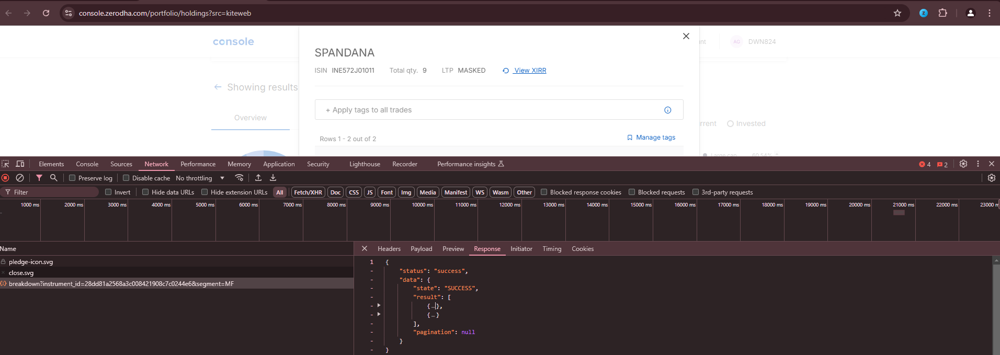
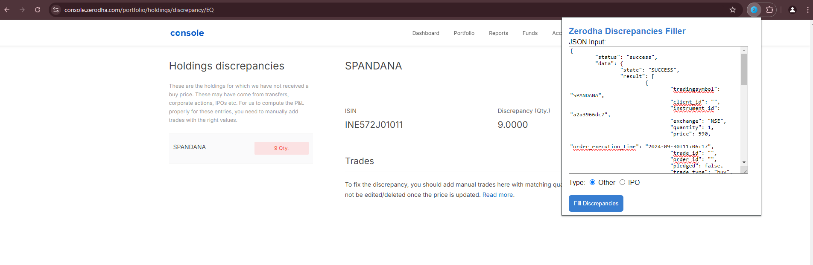
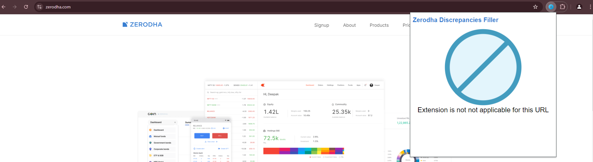
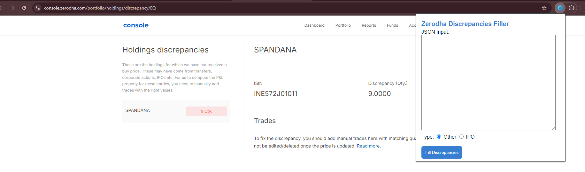
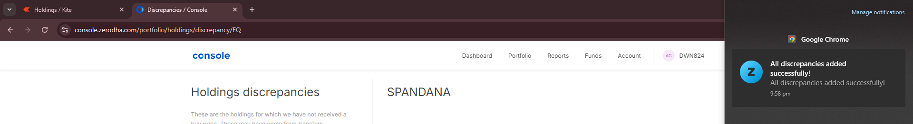

    

# Zerodha discrepancy filler

A chrome extension that can take JSON response as input and fill the discrepancies in Zerodha console.

## Steps to use the extension

### Before transferring the stocks

- From the source account navigate to your console. Open the developer console by ***Right Console -> Inspect***. Navigate to network tab in developer console.
- In Zerodha console for the stock you are planning to transfer open the ***View Breakdown*** option. 
- In the network tab you can see a call with ***breakdown*** as shown in the below image. Select that call and navigate to the response window and copy the full response and save for future use.

### After transferring the stocks

- Once the shares are transferred go the target account and open the console.
- Select the stock and use the option ***View discrepancy***. Go the specific page of the stock you want to enter the discrepancies.
- Click on the chrome extension icon. Paste the response JSON you copied before transferring the stocks into the input button and hit ***Fill discrepancies*** button.

- The extension will start to will the records one by one.

**Note** : Do not close the chrome extension window while discrepancies are added. Closing this can lead to unexpected failures and the adding process will be terminated intermittently.

## Demo

## Features

- the extension will work only in chrome zerodha discrepancy console. In other places an warning message

- When we are in zerodha console discrepancy page we can see the extension form

- When all the records are added / failed due to a any invalid input data / error from zerodha / invalid user input an chrome notification will be sent

## Supported Browseer

[]